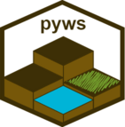

# pywatemsedem

The pywateùsedem package is a Python wrapper for.
[WaTEM/SEDEM](https://watem-sedem.github.io/watem-sedem/).
The aim of the pywatemsedem package is to:

 - Automate GIS IO processing.
 - Provide tools to interact with WaTEM/SEDEM.
 - Run WaTEM/SEDEM

The package is implemented in Python and best used with the tutorial
notebooks available on this page.

## Getting started

This package makes use of Python (and a number of dependencies such as
Geopandas, Rasterio, Pandas and Numpy). To install the package:

```
pip install pywatemsedem
```

Make sure to check out the installation instructions and follow the example in
the _Get started section_ of the [package documentation](https://watem-sedem.github.io/pywatemsedem/).

## Documentation

The documentation can be found on the
[pywatemsedem documentation page](http://watem-sedem.github.io/pywatemsedem).

## Code
The open-source code can be found on
[GitHub](https://github.com/watem-sedem/pywatemsedem/).

## License
This project is licensed under **TO DO**, see
[LICENSE](./LICENSE) for more information.

## Projects
The pywatemsedem package has been used in following projects:

 (see also [here](https://www.interreg2seas.eu/en/triple-c))


Contact
-------
For technical questions, we refer to the documentation. If you have a
technical issue with running the model, or if you encounter a bug, please
use the issue-tracker on github:
[https://github.com/watem-sedem/pywatemsedem/issues](https://github.com/pywatemsedem/issues)

Powered by
----------


