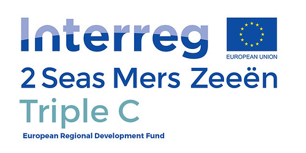

.. figure:: _static/png/logo_pyws.png
 :scale: 50 %

pyws
====

The pyws package is a Python wrapper for.
`WaTEM/SEDEM <https://watem-sedem.github.io/watem-sedem/>`_.
The aim of the pyws package is to:

 - Automate GIS IO processing.
 - Provide tools to interact with WaTEM/SEDEM.
 - Run WaTEM/SEDEM

The package is implemented in Python and best used with the tutorial
notebooks available on this page.

Getting started
---------------

This package makes use of Python (and a number of dependencies such as
Geopandas, Rasterio, Pandas and Numpy). To install the package:

``
pip install pyws
``

Note that it relies on dependencies you need to install yourselves, see
:ref:`installation instructions <installation>` for more information
and follow the example in the :ref:`Get started <getstarted>` page

Documentation
-------------
The documentation can be found on the
`pyws documentation page <http://watem-sedem.github.io/pyws>`_.

Code
----
The open-source code can be found on
`GitHub <https://github.com/watem-sedem/pyws/>`_.

License
-------
This project is licensed under **TODO**, see
:ref:`here <license>` for more information.

Projects
--------

The pyws package has been used in following projects:

Contact
-------
For technical questions, we refer to the documentation. If you have a
technical issue with running the model, or if you encounter a bug, please
use the issue-tracker on github:
[https://github.com/watem-sedem/pyws/issues](https://github.com/pyws/rfactor/issues)

If you have questions about the history or concept of the model that are
not answered in the documentation please contact KU Leuven via
https://ees.kuleuven.be/en/geography/modelling/erosion/pyws/contact.

Do you have questions about the application of pyws in Flanders? Please
contact Departement Omgeving of the Government of Flanders on
cn-ws@omgeving.vlaanderen.be

Powered by
----------

.. figure:: _static/png/DepartementOmgeving_logo.png
 :scale: 70 %
 :target: https://omgeving.vlaanderen.be/

