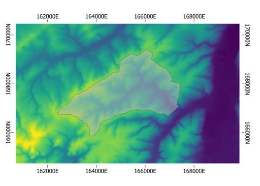

Geo-module
==========

.. _rasterproperties:

Introduction
------------
The pywatemsedem package makes use of a number of GDAL and SAGA command line
operators to process raster data (for reasons of processing speed). In order
to cope with this file-based system, but still make use of numpy arrays for
processing in Python, a :class:`pywatemsedem.geo.rasters.RasterFile` and
:class:`pywatemsedem.geo.rasters.RasterMemory` class is
implemented. The aim of these engines is to couple raster file/numpy arrays to
specific raster properties. Second, this engine aims to perform simple
clipping and masking for input data. Third, this engine makes use of a class
:class:`pywatemsedem.geo.rasterproperties.RasterProperties`, which aims to enable
easy switch between raster geographic references of gdal and rasterio,
respectively named *gdal_profile* and *rasterio_profile*.

The aim of this tutorial is to examplify the use of the
:class:`pywatemsedem.geo.rasterproperties.RasterProperties`
and the :class:`pywatemsedem.geo.rasters.RasterFile` class. Note that the example
files in this tutorial can be found in ``pywatemsedem/pywatemsedem/test/geo/data``.

For this example, we assume we have a raster available which defines the
geographical boundaries, the resolution (20 m) and coordinate system (in this
case Lambert72, i.e. EPSG:31370) of your model:

Defining the raster properties for this raster can be done by:

.. code-block:: python

    # imports
    from pywatemsedem.geo.utils import load_raster
    from pywatemsedem.geo.rasterproperties import RasterProperties
    from pathlib import Path

    # input file
    input_folder = Path(r"$YOURINPUTFOLDER")
    file_path = input_folder / "example_input_raster.tif"

    # load raster and rasterio profile
    arr, rasterio_profile = load_raster(file_path)

    # define rasterproperties with rasterio profile
    rp = RasterProperties.from_rasterio(rasterio_profile)
    print(f"bounds: {rp.bounds}")
    print(f"epsg: {rp.epsg}")
    print(f"resolution: {rp.resolution}")
    print(f"nodata: {rp.nodata}")

The instance ``rp`` of the class
:class:`pywatemsedem.geo.rasterproperties.RasterProperties` can now be used te
define the extent of other rasters with the help of the class
:class:`pywatemsedem.geo.rasters.RasterFile`.
Yet, before we do so, we first want to narrow our spatial domain by clipping
a part of the input raster. We do this by defining left x boundary, lower y
boundary, right x boundary and upper y boundary by the values
162300, 165760, 167560 and 169520 respectively (keeping in mind the coordinate
system Lambert72 and a resolution of 20 m):

.. code-block:: python

    bounds = [162300, 165760, 167560, 169520]
    resolution = 20
    nodata= -9999
    epsg = 31370
    rp = RasterProperties(bounds, resolution, nodata, epsg)
    print(f"bounds: {rp.bounds}")
    print(f"epsg: {rp.epsg}")
    print(f"resolution: {rp.resolution}")
    print(f"nodata: {rp.nodata}")

Rasters
-------

We have now predefined our geospatial context, and we want to clip our input
according to this definition using
:class:`pywatemsedem.geo.rasters.RasterFile`-engine:

.. code-block:: python

    # imports
    from pywatemsedem.geo.rasters import RasterFile

    # clip
    raster = RasterFile(file_path, rp=rp)

    # rp (and properties) is an attribute of the raster
    print(raster.rp.bounds)

Which results to:

Do note that if no :class:`pywatemsedem.geo.rasterproperties.RasterProperties`
``rp`` is defined, no clipping will occur:

.. code-block:: python

    raster = RasterFile(file_path)
    print(raster.rp.bounds)

And in addition, note that using incorrect bounds as follows:

.. code-block:: python

    rp_ = RasterProperties([230, 760, 560, 1000], 20, -9999, 31370)
    raster = RasterFile(file_path, rp=rp_)

will lead to an error:

.. error::

    Clipped output raster is empty. Make sure your input raster covers your
    defined spatial extent (bounds: [230, 760, 560, 1000], resolution: 20,
    espg: EPSG:31370).

Masking with a (1, 0)-array is also available. The ones indicate no masking,
the zeros indicate masking.

.. code-block:: python

    from pywatemsedem.geo.utils import vct_to_rst_field
    rst_mask = Path(input_folder) / "mask.tif"
    mask = RasterFile(rst_mask)

Masking can easily be done as follows:

.. code-block:: python

    raster = RasterFile(file_path, arr_mask=mask.arr)

or

.. code-block:: python

    raster = RasterFile(file_path)
    raster.mask(mask.arr)

We want to write our result to disk (note that the raster format should be defined):

.. code-block:: python

    raster.write("output.tif",format="tiff)

You can write it to an idrisi raster:

.. code-block:: python

    raster.write("output.rst",format="idrisis")

You can also raise an error when format and extension do not overlap:

.. code-block:: python

    raster.write("output.rst",format="tiff")

.. error::

    Can not write file ('output.rst')  in format 'tiff' with '.rst' extension.

Or make a nice plot the result while ignoring nodata values:

.. code-block:: python

    raster.plot(nodata=nodata)

Our result should look like:

Besides static plots, also interactive plots can be made as follows:

.. code-block:: python

    raster.hv_plot(nodata = nodata)

Remark that coordinate system has changed to WGS 84 (EPSG:4326). The
interactive features (such as zooming, hovering...) are only accessible in
a Jupyter Notebook environment.

.. note::

    In order to use the hv_plot functionality, one has to install hvplot
    and geoviews. See :ref:`installation page <https://rasterio.readthedocs.io/en/stable/>`.

The :class:`pywatemsedem.geo.rasters.RasterMemory` class can be used in a
similar way:

.. code-block:: python

    from pywatemsedem.geo.rasters import RasterMemory
    arr, profile = load_raster(file_path)
    raster = RasterMemory(arr, RasterProperties.from_rasterio(profile))
    raster.mask(mask.arr)

Do note that clipping in :class:`pywatemsedem.geo.rasters.RasterMemory` is not
implemented in the current version.

.. note:

    The class :class:`pywatemsedem.geo.rasterproperties.RasterProperties` is
    generated for switching between the two profiles in pywatemsedem, it does not
    aim to replace functionalities in rasterio.

Vectors
-------
Similar to :class:`pywatemsedem.geo.rasters.RasterFile`, one can  make use
:class:`pywatemsedem.geo.vectors.VectorFile` to define vector data:

.. code-block:: python

    from pywatemsedem.geo.vectors import VectorFile

    input_folder = Path(r"$YOURINPUTFOLDER")
    file_path = input_folder / "Wlas_langegracht.shp"

    vector = VectorFile(file_path)
    vector.plot()

and clip:

.. code-block:: python

    input_folder = Path(r"$YOURINPUTFOLDER")
    file_path = input_folder / "Wlas_langegracht.shp"
    file_path_clip = input_folder / "catchm_langegracht.shp"

    vector = VectorFile(file_path,vct_clip=file_path_clip)
    vector.plot()

with the option to rasterize to a :class:`pywatemsedem.geo.rasters.RasterFile`-class
(using the mask as reference raster):

.. code-block:: python

    input_folder = Path(r"$YOURINPUTFOLDER")
    reference_raster = input_folder / "mask.tif"
    raster = vector.rasterize(reference_raster)

A numpy array is returned.
